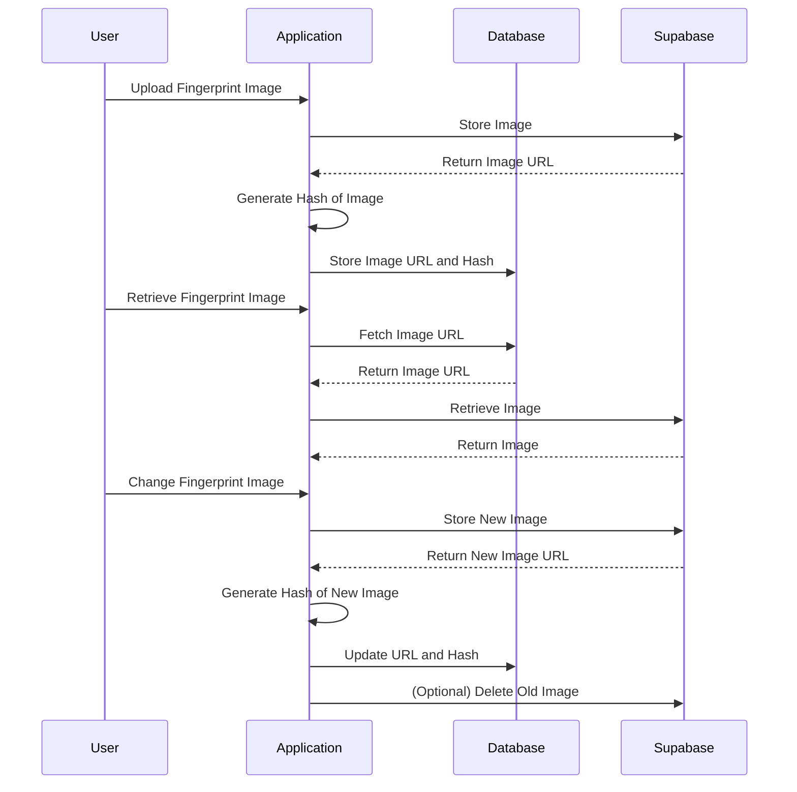
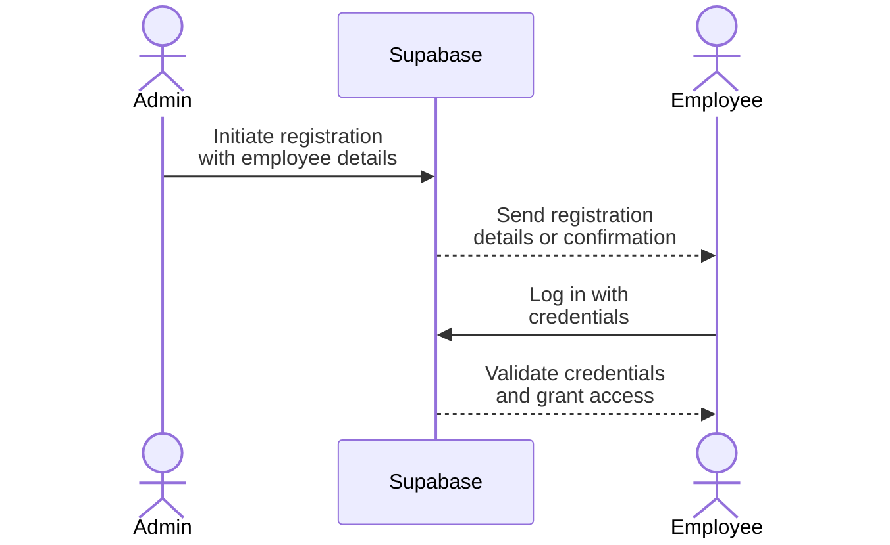
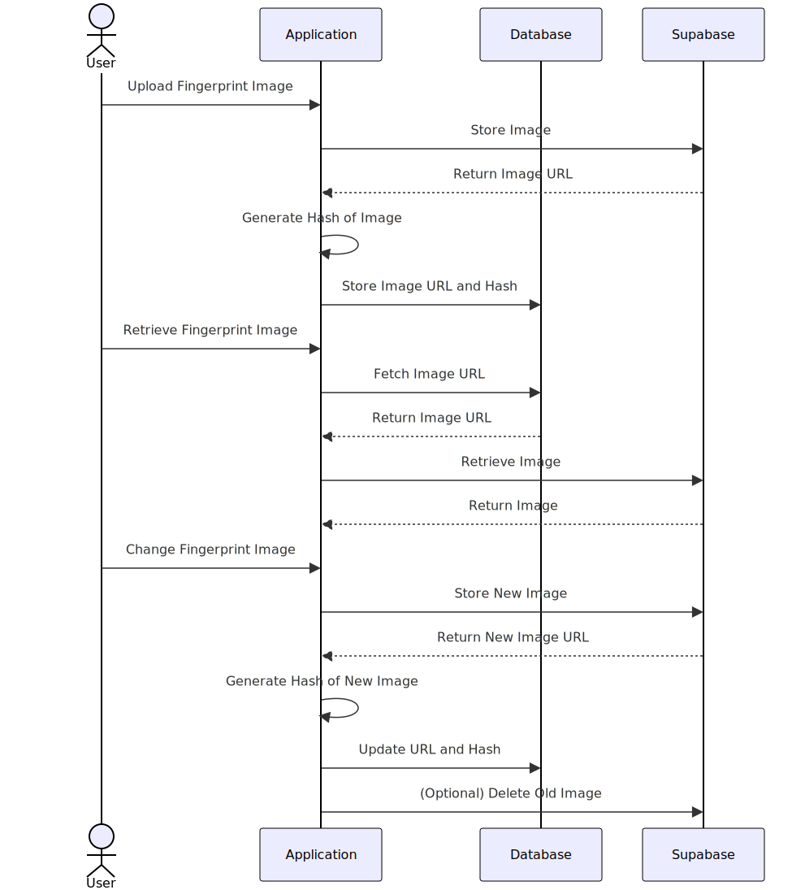

Logical Grouping:
Main Navigation: Contains frequently used primary features.
Additional Navigation: Includes supplementary or less frequent options.

# Method of Storing Fingerprints

# Registration and Login Process

